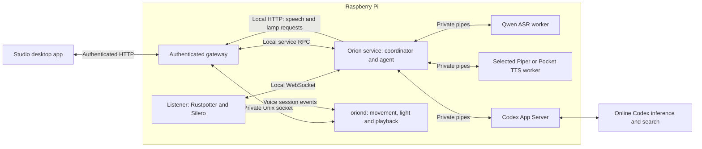

# Orion system architecture

Orion's Raspberry Pi runs microphone capture, speech recognition, speech
synthesis, the agent coordinator, and the hardware runtime. Studio connects to
the Pi for editing, controls, settings, and observation. Codex App Server runs
on the Pi, while Codex model inference and web search use online services.

## System boundary



The Pi uses four systemd services. Their processes have separate responsibilities
so model execution and network waits stay outside the 50 Hz movement loop.

| Service | Responsibility |
| --- | --- |
| `oriond` | Servos, movement completion, character animation, RGBW output and speaker playback |
| `orion-listener` | Microphone capture, Rustpotter wake candidates, Silero speech boundaries and voice-session state |
| `orion-voice-stack` | Runs `orion-service`, which owns the coordinator, agent, speech workers and saved voice settings |
| `orion-studio-gateway` | Authenticates requests, manages asset publication, forwards service controls and spools response audio |

The hardware and MuJoCo backends use the same movement lifecycle and trajectory
compiler. Each backend supplies its own joint feedback. See the
[motion architecture](motion-and-animation-architecture.md) for execution details.

## Authority boundaries

### Hardware runtime

`oriond` owns the servo bus, RGBW device and ReSpeaker playback. It applies
calibration, compiles trajectories, checks measured movement completion, and
coordinates scenes, speech animation, idle behavior, rest and scheduled alerts. Clients
submit named poses, motions, scenes or other supported operations. Every movement
passes through the runtime's limits and ownership checks.

### Listener and voice service

The listener keeps microphone capture open unless the saved mute setting disables
it. Rustpotter detects a possible wake phrase and registers a silent session. The coordinator verifies a short recording with Qwen while the
listener continues recording the command. Silero decides when speech has ended.

`orion-service` owns one agent executor and a restartable voice coordinator. The
coordinator sends inference jobs to separate ASR and TTS workers, calls the agent
through Rust channels, uploads reply audio, and waits for playback completion.
Keeping the agent alive across an idle coordinator restart preserves the
conversation. Restarting the service starts a fresh conversation and retains
saved memory and personality.

A confirmed command reaches Codex as text. The available agent tools support web
search, explicit memory operations, validated lamp and mode changes, sleep, timers
and alarms. Character motion
comes from runtime behavior or explicit user controls. See the
[voice architecture](voice-architecture.md) for capture, conversation and playback
ordering.

### Gateway

The gateway exposes versioned operations for assets, movement, lighting, speech,
settings and status. Hardware requests use `/tmp/oriond.sock`. Voice settings and
observation use the service's private loopback RPC connection. The onboard
coordinator also reaches the gateway over loopback to upload speech and apply
lamp changes.

Remote access uses a bearer token over HTTP and assumes a trusted local network.
The listener restricts its processing connection to loopback; authenticated
control clients can still inspect or change microphone mute. The service's
private credentials stay on the Pi.

### Studio

Studio owns asset browsing, editing, previews and its connection to the gateway.
It stores desktop pairing credentials and local UI preferences. Voice settings,
agent personality, memories and microphone mute are saved on the Pi. Studio polls
bounded event snapshots for transcripts, model information and timing.

Editing a draft changes the preview. Publishing or choosing an explicit robot
control sends a request to the Pi. The connected runtime compiles movement
previews against its calibration. Static model previews do not show live joint
telemetry.

## Assets and installed releases

The deployment builds runtime, gateway, listener and voice-service code from one
Git commit in a separate release directory. Python environments belong to that
release. Shared model files and native inference tools live under
`~/.local/share/orion/voice-stack/`.

The runtime and gateway keep the existing catalog root, normally
`/home/mofe/dev/orion`. It contains the calibrated pose library, motion definitions,
scenes, audio cues and user assets. Updating executable paths therefore preserves
the robot's saved rest pose and authored content. Catalog changes require an
explicit asset edit or publication; they are not applied by the code release
switch.

User poses, motions and scenes live in `motion/user/poses/`,
`motion/motions/user/` and `scenes/user/`. The gateway stages published changes,
asks `oriond` to validate and reload the catalog, and restores the previous files
if reload fails. Built-in names cannot be shadowed. Standalone user poses and
motions use a new name for changed content. Updating or deleting a user scene
requires the content revision that Studio loaded.

The [quickstart](quickstart.md#deploy-to-the-pi) describes preparation, activation,
readiness checks and rollback. [Configuration](configuration.md) identifies saved
settings and the paths that each release manages.

## Runtime state

Movement follows this lifecycle:

```text
executing -> settling -> completed
                      \-> timed_out
executing/settling ----> cancelled
```

Scenes coordinate movement, lighting and audio under one monotonic clock. They
finish after their dispatched work reaches a terminal result. Runtime status
keeps the active movement and most recent terminal movement. Run IDs and retained
results reset when the daemon restarts.

Daemon startup enables character mode by default: it configures the servos,
enables holding torque and moves home. Measured arrival establishes an anchor
for idle and speech animation. Foreground motion or scenes take priority over
speech, listening or thinking reactions, and idle. Repeated thinking events keep
the existing gesture running; a change from transcription to agent processing
does not replay its opening tilt.

Studio's **Stop character** cancels owned work, returns home and leaves torque
holding. Character behavior resumes after an explicit start or a daemon restart
with character mode enabled. `--character-on-start off` starts maintenance mode
with torque disabled. Microphone mute has its own saved setting.

## Automatic rest and waking

Idle mode arms the inactivity timer after successful homing. The default interval
is 30 minutes. Lamp mode keeps the same idle animations and disables automatic
rest. Selecting idle mode starts a fresh inactivity interval. The selected mode
survives service restarts and code deployments. Each voice session can reset the
deadline once through an accepted
Qwen wake confirmation. Candidates, rejected wakes and ordinary animation do
not reset it.

An active confirmed conversation, including the follow-up listening window,
defers rest. Foreground movement, scenes, queued or playing speech, and speech
settling also defer it. Once that work finishes, an expired deadline can start
rest immediately. Background idle and unconfirmed thinking can yield to rest.

The rest coordinator tracks the descent by movement run ID and releases torque
only after measured completion. A timeout, cancellation, missing result or failed
torque release enters `fault`. A failed home movement during waking also enters
`fault`. Automatic waking and voice reply playback then await explicit recovery.

At mechanical rest, a wake candidate stays silent while the body remains still
and the light stays off. Qwen confirmation plays the acknowledgement chime and
starts the return home. If confirmation arrives during descent, Orion finishes descending and then
returns home while retaining torque. Capture continues during both movements.
After home completes, the runtime applies the latest listening or thinking state
and checks any direction evidence before turning toward the speaker.

Studio's **Go to rest** starts this sequence immediately. The `go_to_sleep` agent
tool queues rest behind its spoken acknowledgement and closes the voice session
without a follow-up window. Explicit sleep works in either mode and keeps the
selected mode for the next wake. Explicit Stop,
`disable`, and maintenance startup disable automatic waking; an explicit character
start rearms it. The lower-level `goto rest` command moves the body and requires
a separate torque-release command after verified arrival. See
[confirmed waking](voice-architecture.md#confirmed-waking) for reply ordering.

## Timers and alarms

The runtime owns one-time timers and clock alarms. Once created, they run without
Studio, Codex or a network connection. Timers use elapsed time while the daemon
runs; clock alarms use an explicit timestamp. On restart, the runtime reconstructs
timer deadlines from saved wall-clock times, so an accurate Pi clock matters.

A due alert interrupts scene audio and speech, then repeats the selected sound
through the normal audio device. The default two-tone signal includes short gaps
to help the microphone hear the wake phrase. The two recorded alternatives use
[prepared PCM embedded in the runtime](../audio/README.md#alarm-and-timer-sounds),
so the motion loop does no file reads or audio decoding. An alert can ring at rest
without enabling torque or moving home. Ringing defers automatic rest while Orion
is awake.

Studio **Settings → Voice and sounds** saves separate alarm and timer defaults on
the Pi. The runtime chooses a sound when an alert starts, including alerts scheduled
before the setting changed. Overlapping alerts share the sound chosen by the first
alert to ring. Changing a default while ringing applies to a later alert group.

The listener checks alert status every 200 ms. While an alert rings, Rustpotter
runs even if a conversation was playing. Saying “Hey Orion” dismisses the alert
locally and ends that interaction; a later wake can start a conversation. This
dismissal does not require Qwen confirmation. Muting the microphone prevents voice
dismissal; Studio also provides **Stop sound**. The runtime stops playback after
five minutes. Alerts that overlap share that limit rather than extending it.

Mode, pending alerts and recent results are saved atomically in the
[routines file](configuration.md#saved-files). Sound preferences use its companion
`routines.sounds.json`, keeping the alert file compatible with older releases.
Before ringing, the runtime saves the selected sound with its ringing deadline;
a restart reuses that sound only when the saved deadline matches the alert.
It resumes playback for the remaining time. Alerts missed by five minutes or more are marked
missed. A shorter delay uses the remainder of the original five-minute window.
Playback failures appear in routine status. The scheduler accepts at most 16
active alerts and retains up to 32 recent entries.

## Light and rest status

Descent freezes the visible light frame and fades it to black over one second.
The light-device wrapper then suppresses output while descending, resting or in
a rest fault. Stored lamp preferences survive. Waking releases the output gate
so expressive lighting can resume.

`/api/v2/status` reports rest as `disabled`, `awake`, `going_to_rest`, `resting`,
`waking` or `fault`. It also includes the timeout, last accepted confirmation,
remaining time, tracked movement, effective light power and any transition error.
Remaining time can be zero while active work defers rest. Studio uses these fields
to show rest progress and the lamp's effective power.

## Validation limits

Component and daemon tests cover timing, session ownership, measured completion
and injected failures. The deterministic driver follows commanded positions to
exercise software behavior. Native MuJoCo adds physics; its rest test includes a
known arm/base contact failure that prevents the shoulder reaching rest and
therefore keeps torque enabled.

Physical checks establish whether the assembled robot reaches supported rest,
returns home smoothly, retains speech captured while waking, and plays clear
audio. Microphone direction, echo and cable clearance also require the robot.
See the [runtime tests](../runtime/README.md#build-and-test) and
[hardware setup](../hardware/servo_setup/README.md).
