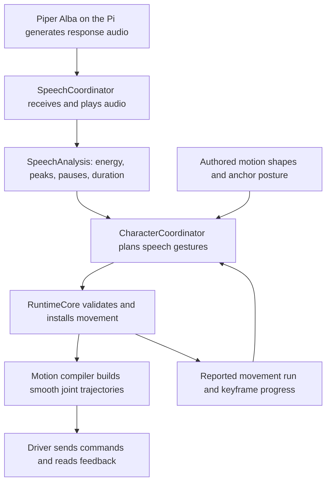

# Orion's speech animation runtime

Orion turns the sound and timing of its spoken response into a continuous sequence of head and body gestures. It can plan ahead while audio arrives in chunks, revise the unperformed part of a movement, and return to the anchor posture used for that speech performance.

The central rule is **planning a gesture must not make the character remember that gesture as already reached**. A candidate plan describes the future. Speech-memory checkpoints allow the coordinator to adopt that future's history as the movement timeline progresses.

Examples marked “illustrative” explain the algorithm using synthetic timings and
positions. The validation section links the corresponding tests.

## 1. Where this belongs in Orion

### The application boundary

The Pi listener captures the command, and the onboard coordinator runs Qwen,
Codex and Piper Alba Medium to produce a response. The coordinator sends audio through the
local gateway to `oriond`. Speech animation follows playback of that response.
Capture, recognition and synthesis have separate owners described in the
[voice architecture](docs/voice-architecture.md).

The character coordinator receives audio measurements and decides how Orion should gesture. The runtime core owns movement execution. The driver sends joint commands and supplies feedback. Keeping these responsibilities separate allows animation to vary without bypassing motion ownership or calibrated joint limits.



The core calls the compiler while preparing a movement. The diagram shows that
call sequence within the runtime process.

Sources: [voice architecture](docs/voice-architecture.md), [daemon loop](runtime/src/app/server.rs), [runtime core](runtime/src/control/core.rs), and [motion architecture](docs/motion-and-animation-architecture.md).

### The runtime's application layout

The character implementation lives in [expression/character.rs](runtime/src/expression/character.rs). Audio playback and waveform analysis live in [expression/speech.rs](runtime/src/expression/speech.rs).

The thin `runtime/src/main.rs` delegates to the application module. [app/server.rs](runtime/src/app/server.rs) owns startup and the daemon loop, while [app/commands.rs](runtime/src/app/commands.rs) dispatches commands. The control, motion, device, expression, and IPC modules supply those application operations.

Deployment builds the package in `runtime/`. See [runtime instructions](runtime/README.md) for build and operation commands.

### What happens during each application update

The daemon targets an update every 20 milliseconds, or 50 updates per second. In its loop it:

1. Updates `RuntimeCore`, including feedback and movement progress.
2. Updates scene execution.
3. Updates speech playback.
4. Detects a newly playing audio run and calls `note_speech_started()`.
5. Updates speaking lighting from the active audio energy.
6. Calls the character's `tick()` with scene state, audio-playing state, analysis, and the current audio frame.
7. Applies other eligible lighting and handles incoming commands.

Speaking lighting and speech gestures therefore share audio information but follow separate rendering and movement paths. These gesture-planning methods do not themselves render the lights.

While audio is playing, the character's `tick()` calls `tick_speaking()`, unless an earlier priority branch such as startup or an active scene returns first. Once audio stops, the outer `tick()` handles the speech movement's return and completion.

Each tick is one update. It does not sleep until a gesture finishes. Persistent fields retain the information needed by the next update.

## 2. Vocabulary and units

| Term | Meaning in this implementation |
| --- | --- |
| Utterance | One spoken response being played. It can contain several sentences and many network chunks. |
| Clip | A named authored motion, such as `speak_reflective_tilt`. The composer borrows its first target shape. |
| Drawing or gesture | A planned expressive shape with head targets, body targets, timing, and history. It is not a bitmap image. |
| Keyframe | A movement stage with a target, travel duration, arrival behavior, and optional hold. |
| Head lead | The stage in which the head establishes a gesture while the body retains its previous shape. |
| Body follow | The subsequent stage in which shoulder and elbow follow the head's gesture. |
| Body beat | A stronger shoulder-and-elbow accent, admitted only by additional emphasis and spacing rules. |
| Anchor | The complete reference posture around which relative character movements are resolved. |
| Checkpoint | A keyframe index paired with the speech history to adopt after execution passes that keyframe and its hold. |
| Committed history | In this explanation, the planning history adopted from execution progress. It is not a database commit or a physical measurement of every gesture. |
| Run ID | The identifier of a particular execution. Audio runs, movement runs, and scene runs have different ownership and must not be confused. |
| Through arrival | A waypoint through which movement flows without deliberately stopping there. |
| Settle arrival | A waypoint intended to arrive with zero velocity and acceleration; it may also include a hold. |
| Runtime settling | The final movement phase in which feedback is checked for sufficiently small position error and speed. |

### Joint positions and relative offsets

`JointPositions` is a `BTreeMap<String, f64>`: joint names mapped to numbers. Angles use radians. The five joints are base yaw, shoulder pitch, elbow pitch, head roll, and head pitch.

The same Rust type represents different things in different places:

- An anchor contains reference joint positions.
- A speech drawing contains joint offsets relative to that anchor.
- Runtime feedback contains measured joint positions.

The motion's coordinate space determines how its target map is interpreted. An illustrative single-joint calculation is:

```text
anchor head pitch = 0.30 radians
gesture offset    = 0.05 radians
target            = 0.35 radians, before style and calibration scaling
```

The implemented relative-target calculation is:

```text
target[joint] = anchor[joint] + offset[joint] × style.amplitude × uniform_scale
```

Each target is resolved independently from the anchor. Gestures do not repeatedly add their offsets to the previous gesture's final position. An empty relative target means zero offsets for every joint, so it resolves to the anchor, not to physical joint angle zero.

Source: `resolved_targets_with_scale()` in [library.rs](runtime/src/motion/library.rs).

### Several clocks coexist

| Value | Unit and reference point |
| --- | --- |
| `now` | Seconds since the daemon's monotonic clock started. |
| `frame` | Audio-analysis frame index; one frame represents 0.020 seconds. |
| `elapsed` in `tick_speaking()` | `frame × 0.020`, giving approximate elapsed response playback time. |
| `analysis.duration_seconds` | Length of the audio received so far, or the complete audio when final. |
| `speech_planned_until` | Received-audio length used for the current plan or initial planning attempt. |
| `speech_seconds` | Accumulated gesture-planning time retained across checkpoints and replacements. |
| `authored_seconds` | Local planning time before the motion compiler's style and speed adjustments. |
| `speech_gesture_index` | Gesture count across the utterance's adopted history. |
| Checkpoint index | Keyframe index within the currently installed motion plan. |

A replacement can retain its movement run ID while starting a new local trajectory timeline and a new list of local keyframe indices. The saved gesture count and history allow the overall speech performance to continue coherently across those replacements.

## 3. What the audio analysis supplies

The shared data structure is:

```rust
pub struct SpeechAnalysis {
    pub rms_20ms: Vec<f64>,
    pub quiet_regions: Vec<(usize, usize)>,
    pub phrase_peaks: Vec<usize>,
    pub duration_seconds: f64,
    pub streaming: bool,
}
```

`rms_20ms` describes the audio energy in successive short frames. Root-mean-square, or RMS, is a way of measuring signal magnitude that prevents positive and negative waveform samples from cancelling each other out. Higher values generally indicate stronger audio energy; they do not identify the meaning of words.

In `analyze_pcm()` in [speech.rs](runtime/src/expression/speech.rs), response audio is mono, 24 kHz, signed 16-bit PCM. Each 20 ms frame contains 480 samples. Samples are normalized, their RMS is calculated, and that measurement is smoothed:

```text
smoothed energy = 0.65 × previous smoothed energy + 0.35 × current frame RMS
```

Quiet regions use an energy threshold of the greater of 12% of maximum energy and 0.004. Internal quiet runs shorter than three frames are discarded; a trailing quiet run is retained. Regions are stored as start and end frame indices, with the end marking the boundary after the quiet region.

Phrase peaks are local energy peaks at least 1.35 times the mean energy and at least ten frames apart. “Phrase” is the implementation's label for a useful audio landmark. It is not proof of a grammatical phrase boundary or an important word.

On stream append, the speech coordinator reanalyzes the accumulated PCM and marks the analysis as streaming. An explicit stream-end message sets `streaming = false` without necessarily increasing the audio duration. Playback can continue while that final audio drains.

The current audio frame is estimated from elapsed software playback time. It is not a direct measurement of the sample currently leaving the speaker. Buffering, driver behavior, trajectory retiming, and physical following all limit exact audio-motion synchronization.

The analyzer's modest quiet-region threshold and the composer's longer quiet-hold requirement serve different purposes: detecting a pause does not automatically mean the robot will stop and hold there.

## 4. The information speech planning remembers

### `SpeechMemory`

```rust
#[derive(Clone, Debug)]
struct SpeechMemory {
    rng: SeededRandom,
    clip: Option<String>,
    recent: Vec<String>,
    index: usize,
    body_beat: Option<usize>,
    tilt: f64,
    turn: i8,
    body: JointPositions,
    seconds: f64,
    emphasis_at: Option<f64>,
}
```

One snapshot can be read aloud as: “The previous gesture had this name. These shapes were used recently. This is the next gesture number, the last strong body accent, the previous head and base directions, and the body shape to carry forward. This is our place in gesture time and in the random-choice sequence.”

| Memory field | Coordinator field | Why it matters |
| --- | --- | --- |
| `rng` | `rng` | Restores the random generator's position so discarded future plans do not permanently consume random choices. |
| `clip` | `last_speech_clip` | Excludes an immediate repeat of the preceding speech clip. |
| `recent` | `speech_recent_clips` | Retains up to two recent clip names so earlier shapes can receive lower selection weights. |
| `index` | `speech_gesture_index` | Continues gesture counting across replacement plans; the composer increments it after each drawing. |
| `body_beat` | `speech_last_body_beat` | Remembers the index of the last strong body accent for spacing checks. `None` means none is recorded. |
| `tilt` | `speech_last_tilt` | Remembers a roll-direction choice of -1, 0, or +1, stored as a floating-point value. It is not an angle measurement. |
| `turn` | `speech_last_turn` | Remembers a yaw-direction choice of -1, 0, or +1. It is not the base's measured position. |
| `body` | `speech_previous_body` | Holds the planned shoulder and elbow offsets retained during the next head lead. |
| `seconds` | `speech_seconds` | Carries the planner's accumulated gesture timeline into later plans. |
| `emphasis_at` | `speech_emphasis_at` | Records when emphasis was selected on that timeline, allowing later emphasis to be spaced out. |

These are planning decisions, not a recording of servo telemetry. A snapshot made during composition describes a hypothetical future. A snapshot adopted after a checkpoint describes history reached according to the movement timeline.

`SpeechMemory` is an internal, in-process structure. `Clone` permits copying a snapshot and `Debug` permits a developer-readable representation. These traits do not save the memory to disk or make it survive a process restart. This animation history is separate from an agent's conversational memory of what the user said.

### Other coordinator fields needed for this flow

| Field | Responsibility |
| --- | --- |
| `status.active_anchor` | Stable reference posture for the speech performance. |
| `status.state` | Character activity, such as `Speaking` or `Settling`. |
| `status.active_clip` | Reporting label, often `speaking_performance` or `speak_settle`. It does not enumerate all internal gestures. |
| `speech_motion_run_id` | Movement execution associated with speech, distinct from the audio run ID. |
| `speech_motion_started` | Records that initial movement planning/start was attempted for the utterance. It is set before success is known. |
| `speech_planned_until` | Audio duration associated with the installed replacement or latest initial planning attempt. It is not compiled movement duration. |
| `speech_plan_streaming` | Whether that plan or attempt expected more audio. Compared with fresh analysis to detect a stream-end transition. |
| `speech_checkpoints` | Ordered pairs of local body-follow keyframe indices and future `SpeechMemory` snapshots. |
| `thinking_run`, `active_idle_run_id` | Existing lower-priority movement that may hand over to speech. |

### What resets at a new utterance

`note_speech_started()` normally enters `Speaking`, clears the clip label, allows one fresh startup attempt, resets the audio-coverage fields, and clears gesture count, body-beat history, directions, previous body shape, recent clips, planning time, emphasis time, and checkpoints.

It preserves the anchor, the last speech clip, and the existing movement run ID. The retained last clip helps avoid a repeat across utterances. The retained run ID is checked against active runtime movement before another speech performance starts. The random generator continues its existing sequence; resetting idle timers also consumes random choices.

Disabled character mode and a tracked startup/shutdown return prevent this reset. The audio subsystem owns playback independently.

## 5. Taking and restoring a memory snapshot

### `speech_memory()`

`speech_memory()` gathers the fields in the mapping above into a separate `SpeechMemory` value. It reads the coordinator through `&self` and does not update it.

Strings, the recent-clip vector, the body map, and the random generator are explicitly cloned. Simple numbers and optional numeric values are copied. The resulting snapshot survives subsequent changes to the coordinator's collections.

The method has no knowledge of whether the copied history is already adopted or temporarily speculative. `plan_speech()` calls it to preserve existing history. The composer calls it after updating a hypothetical drawing so that drawing can carry its own future history.

### `restore_speech_memory()`

This method assigns each saved field back to its corresponding coordinator field. It takes ownership of the snapshot, allowing its strings and collections to move into the coordinator without another clone.

Restoring a snapshot changes how future gestures are selected. It does not rewind the audio, send servo commands, move the anchor, or reset the character's entire state. Checkpoints and execution metadata are outside `SpeechMemory` and are managed separately.

### Why the random generator is part of memory

`SeededRandom` stores a 64-bit state. Its `next()` method transforms that state with a sequence of bit shifts and exclusive-or operations. The same starting seed and the same sequence of calls produce the same sequence of values. A zero seed is replaced with one.

`range()` converts a generated value into a floating-point range. `index()` uses a remainder to choose a position in a list. The gesture selectors also use remainders to select weighted tickets.

This supplies repeatable variation for animation and tests. It is not a cryptographic random generator. Identical audio alone does not guarantee identical gestures: prior history, the anchor, idle-timer draws, and the order of random calls also affect the result.

If a discarded candidate consumed six random choices and those changes were retained, the next candidate would begin six choices farther into the sequence despite no corresponding executed progress. Snapshot restoration prevents that accidental advance.

## 6. `plan_speech()`: prepare a candidate without replacing current history

Inputs are the available audio analysis, the authored motion library, and the anchor. The result is either an error or this pair:

```text
(candidate MotionDefinition, candidate checkpoint list)
```

The wrapper deliberately lets `compose_speech_performance()` mutate planning fields temporarily. It then restores the previous context before returning.

```rust
let performed = self.speech_memory();
let committed = std::mem::take(&mut self.speech_checkpoints);
let result = self.compose_speech_performance(analysis, motions, anchor);
let checkpoints = std::mem::replace(&mut self.speech_checkpoints, committed);
self.restore_speech_memory(performed);
result.map(|motion| (motion, checkpoints))
```

The flow is:

1. **Save existing history.** `performed` captures the speech-planning fields before composition.
2. **Set aside existing checkpoints.** `take()` moves the current vector into `committed` and leaves an empty vector in the coordinator.
3. **Compose a candidate.** The composer changes planning history and produces future checkpoints as it constructs gestures.
4. **Extract candidate checkpoints.** `replace()` takes the newly generated vector out and puts the original vector back.
5. **Restore existing history.** The random state and other remembered speech choices return to their saved values.
6. **Return the candidate.** `Result::map()` packages a successful movement with its checkpoints. A composition error remains an error.

Despite its name, `committed` is the checkpoint list belonging to the existing plan. That list generally contains future checkpoints awaiting execution, not already-consumed history.

| Stage | History stored in coordinator | Checkpoints stored in coordinator |
| --- | --- | --- |
| Before planning | Existing history | Existing plan's pending checkpoints |
| During composition | Candidate future history | Candidate future checkpoints |
| After restoration | Existing history | Existing plan's pending checkpoints |
| Return value | Candidate movement is returned separately | Candidate checkpoints are returned separately |

There is intentionally no `?` on the composer call. If composition returns an ordinary `Err`, both restoration steps still run before that error is returned. This is cleanup for returned errors; the wrapper does not claim to restore state after a panic or process termination.

The caller still has to ask `RuntimeCore` to accept and install the candidate. Only successful installation replaces `self.speech_checkpoints` with the candidate list. Thus a normal planning or compilation failure does not replace the old checkpoints with an unexecuted candidate's checkpoints.

## 7. `advance_speech_memory()`: adopt history after a checkpoint

The method reports whether it adopted any new history. `true` means at least one checkpoint was consumed. It does not mean the entire utterance or movement completed.

### Find the relevant execution

The method reads `core.snapshot().motion` and retains it only if its run ID matches `speech_motion_run_id`. With no matching active movement, it returns `false`. This prevents an unrelated movement's progress from advancing speech history.

It next requires `motion.keyframe_index`. An absent index also returns `false`; for example, the runtime clears this field when it enters final measured settling.

### Find checkpoints strictly before the current stage

The checkpoint list is ordered. `take_while(|(at, _)| *at < index)` counts entries from its beginning until the first one that has not been passed. The comparison is strictly less than, because occupying a body-follow keyframe can mean the robot is still travelling through that stage or spending time in its scheduled hold.

Illustrative first plan:

| Keyframe index | Stage | Stored checkpoint |
| --- | --- | --- |
| 0 | Gesture A head lead | None |
| 1 | Gesture A body follow and optional hold | History after A |
| 2 | Gesture B head lead | None |
| 3 | Gesture B body follow and optional hold | History after B |
| 4 | Gesture C head lead | None |
| 5 | Gesture C body follow and optional hold | History after C |
| 6 | Final return to the anchor | None |

At index 1, checkpoint 1 is not eligible. At index 2 it is eligible. If none has yet been consumed and the current index is 4, checkpoints 1 and 3 are both eligible.

### Adopt the newest eligible snapshot once

With no eligible entries, return `false`. Otherwise:

1. Clone the memory from entry `count - 1`, the latest eligible checkpoint.
2. Remove the first `count` entries with `drain(..count)`.
3. Restore that saved memory into the coordinator.
4. Return `true`.

In the index-4 example, the method adopts history after B and leaves only C's checkpoint pending. It does not need to restore A separately: B's snapshot already carries the accumulated state through B. Removing consumed entries prevents the same progress being counted again on the next tick.

The guarantee concerns **execution-timeline progress**. `RuntimeCore::tick()` derives the keyframe index from elapsed trajectory time. The compiler retains a segment until its travel and hold time have passed. This method does not compare each gesture target with sensor measurements; final measured completion is a separate runtime responsibility.

Sources: `advance_speech_memory()` in [character.rs](runtime/src/expression/character.rs), `tick()` in [core.rs](runtime/src/control/core.rs), and `segment_index()` in [trajectory.rs](runtime/src/motion/trajectory.rs).

## 8. `tick_speaking()`: maintain a performance as audio changes

This method is the connection between current audio information, saved speech history, candidate planning, and the executing movement. The outer character `tick()` calls it while audio is playing. It returns no value and handles its movement-planning failures locally so they do not silence playback.

### Step 1: require audio information and update history

Both analysis and an audio frame must be present. Otherwise, return without attempting motion work.

Convert the frame to elapsed audio time with `elapsed = frame × 0.020`. Call `advance_speech_memory(core)` and save its boolean as `gesture_finished`. That boolean means a new checkpoint was passed on this call; it is not a persistent declaration that all previous gestures are finished.

### Step 2: decide whether an existing plan needs replacement

The code distinguishes more audio arriving from the stream declaring its final length. Define:

```text
D = current analysis.duration_seconds
P = speech_planned_until
e = elapsed audio time
G = a checkpoint was consumed on this tick

finalizing = the stored plan expected more audio, but analysis now says final
late_end   = finalizing and D - e <= 0.9 seconds

attempt replacement when:
    late_end
    OR
    G AND (finalizing OR (D > P AND P - e < 1.5 seconds))
```

This creates three distinct cases:

| Situation | Replacement policy |
| --- | --- |
| More audio arrives | Wait for a passed gesture checkpoint and until the previously planned audio frontier is less than 1.5 seconds ahead. |
| End marker arrives with more than 0.9 seconds remaining | Replan at a passed checkpoint even if audio duration did not grow. |
| End marker arrives with at most 0.9 seconds remaining | Attempt a return-only replacement immediately, without requiring a new checkpoint. |

The late-end path returns toward the anchor immediately. This exception to the usual gesture-boundary rule avoids inserting another minimum-length gesture near the end of playback.

`P - e` measures distance to a stored audio frontier. It is not the exact remaining duration of the compiled movement, which may have been retimed.

Illustrative decision: with `P = 3.0`, `D = 5.0`, and `e = 1.8`, more audio exists and the old frontier is 1.2 seconds ahead. A newly passed checkpoint permits extension. Without that checkpoint, ordinary extension waits.

### Step 3: create analysis for the remaining audio

Replacement planning uses a `tail` of the analysis starting at the current audio frame:

- Skip energy frames already before the current frame.
- Subtract the current frame from each remaining peak index; discard peaks before it.
- Discard quiet regions already ended. Shift the remaining start and end indices; a region already in progress begins at tail frame zero.
- Set duration to `max(D - e, 0)` and copy the final/streaming flag.

Illustrative frame conversion: if playback is at frame 100, an old peak at 150 becomes tail peak 50; a peak at 80 is discarded. A quiet region `[90, 130)` becomes `[0, 30)`.

The local tail starts its audio coordinates at zero. Speech-memory time and gesture count continue from adopted history. This is why the implementation needs both local frame positions and accumulated planning history.

For final audio with at most 0.9 seconds in the tail, choose `speech_settle_motion()` and an empty checkpoint list. Otherwise, ask `plan_speech()` to compose gestures from the tail.

### Step 4: install only a successful replacement

Call `core.extend_character_performance()` with the existing movement ID, candidate definition, anchor, and current runtime time. The core checks ownership and compiles a replacement from the existing trajectory's commanded state.

On success, install the candidate checkpoints, record the current audio duration, and update whether the plan is still streaming. A return-only replacement also changes the clip label to `speak_settle`.

Updating the streaming flag after successful finalization prevents the same end transition from being treated as new on every tick. A failed finalization does not falsely mark itself installed.

Logs distinguish `speech.motion_extended` and `speech.motion_finalized`. They report the movement ID, remaining audio time, and relevant progress information. Logs describe the chosen path; they do not themselves control motion.

### Step 5: keep an active movement and clear stale tracking

After considering an extension, inspect the runtime's active movement slot. If it still contains this run with a nonterminal phase, return and let it continue. This also preserves an active run in final measured settling.

If the run is absent from that slot, clear `speech_motion_run_id` and its clip label. The runtime retains bounded completion history, so searching indefinitely for an old terminal result could otherwise block later speech after a newer movement replaces that history.

If `speech_motion_started` is already true, return. An utterance gets one initial planning/start attempt. An ended movement is not repeatedly restarted throughout the same utterance.

### Step 6: attempt the initial speech performance

Require an anchor. Take a tracked thinking run if present, otherwise a tracked idle run, and clear the idle category. A holding runtime can start fresh. A tracked lower-priority movement may be eligible for replacement; its ID is verified before that replacement is used.

Set `speech_motion_started = true` before planning, and record the analysis duration and streaming flag. Consequently, these fields can describe an unsuccessful initial attempt. Do not interpret the flag as proof that animation successfully began.

The initial call to `plan_speech()` uses the supplied analysis as a whole. The explicit slicing to the current audio frame belongs to the replacement path above.

If the saved prior run is still the active `Executing` movement, replace its trajectory with speech while retaining that movement ID. Otherwise, request a fresh generated movement; the core requires holding with no active movement. This helper's checks do not bypass the core's ownership checks.

On success, store the new checkpoints and movement ID and report `speaking_performance`. On planning or installation failure, audio continues. An initial failure is not retried every tick because the attempt flag is already set; an eligible failed extension leaves the existing plan in place.

## 9. `compose_speech_performance()`: turn audio into gesture keyframes

The composer builds a `MotionDefinition`. It does not execute it or directly send servo commands. Its work has two main passes: choose gesture drawings, then convert those drawings into a staged keyframe sequence.

### 9.1 Allocate time for gestures and the final return

The whole generated performance uses the named `speaking_emphatic` style, whose tempo is 1.12. An individual gesture's emphasis flag still changes its shape and selection policy; it does not switch the entire generated definition between the source clips' styles.

The initial time budget is:

```text
performance_seconds = max(audio_duration + adjustment, 0.9)
adjustment = +1.5 while streaming, otherwise -0.12

authored_budget = performance_seconds × style.tempo
settle_budget   = max(min(0.55 × style.tempo, authored_budget × 0.35), 0.16)
active_budget   = max(authored_budget - settle_budget, 0.24)
```

The streaming allowance provides a provisional future beyond the received audio. Complete audio uses a small nominal end lead. Every candidate still includes a final return; successful extensions normally replace the future before that provisional ending is reached.

For an illustrative complete ten-second recording:

```text
performance_seconds = 9.88
authored_budget      = 11.0656
settle_budget        = 0.616
active_budget        = 10.4496
```

Authored units account for the style's later travel-time conversion. These values are planning budgets, not promises of exact wall-clock completion. Unused active time can join the final return, and style, holds, and speed retiming affect execution time.

### 9.2 Start from the adopted speech history

The composer initializes local gesture count, last tilt and turn, last body-beat index, base speech time, and previous body shape from the coordinator. This lets a replacement continue from its adopted history instead of beginning again at gesture zero.

It also finds the maximum energy in the analysis supplied to this call. For a replacement, that analysis is the tail. A body's energy gate is therefore relative to the maximum of the supplied audio region, not a fixed loudness threshold shared across every utterance.

### 9.3 Find a nearby peak and decide whether emphasis is allowed

While more than 0.22 authored seconds of active budget remain, compute the audio frame corresponding to the planned start of the next gesture.

Advance a peak cursor past peaks more than ten frames behind that point. Consider the next remaining peak only if it is no more than 25 frames ahead. Thus “lookahead” is half a second, but a recently passed peak can still be eligible within the ten-frame allowance. The algorithm does not search every candidate for the strongest nearby peak.

An eligible peak becomes emphasis only if no emphasis is recorded yet or at least 3.5 seconds have passed on the planning timeline since the previous emphasis selection. This spacing concerns planned gesture time, not exact hardware-measured intervals between visible nods.

The body receives a stronger accent only when all these conditions hold:

1. This drawing is an emphasis drawing.
2. Its peak energy is at least 72% of the maximum in the supplied analysis.
3. Its gesture index is at least three greater than the previous body-beat index, or no body beat is recorded.
4. The previous speech clip was not `speak_explanatory_lean`.

A difference of three indices leaves at least two gestures between strong body accents. It does not schedule an accent every third gesture.

A body beat directly selects `speak_explanatory_lean`. Other cases call `choose_speech_clip(emphasis)`.

### 9.4 Borrow an authored shape and fit a gesture into the budget

The composer loads the selected motion and reads **its first keyframe's target**. It does not concatenate every keyframe from that source clip. Source clips contribute a vocabulary of shapes; the generated performance supplies its own timing, staging, variation, and final return.

For example, [speak_calm_sway.yaml](motion/motions/speaking/speak_calm_sway.yaml) begins with roll `+0.10`, shoulder `+0.06`, and elbow `-0.05` radians. The composer uses those source values while generating a drawing, but it does not automatically replay that clip's second sway and authored return.

Nominal authored gesture duration is:

```text
(0.90 for emphasis, otherwise 1.35)
    × SPEECH_GESTURE_DURATION_SCALE (1.35)
    × a random factor from 0.90 to 1.10
```

Compute `fit = min(remaining_budget / nominal_duration, 1)`. If the fit is below 0.24 and at least one drawing already exists, stop adding drawings rather than squeezing in another very small one. Otherwise, the initial drawing duration is `nominal_duration × fit`.

Even an ordinary duration with a random factor of one is 1.8225 authored seconds, not necessarily 1.8225 physical seconds. The compiler later applies style tempo and other timing adjustments.

### 9.5 Construct head targets

The head receives a random amplitude multiplier: 0.88–1.10 for ordinary drawings and 1.05–1.24 for emphasis.

For head roll, use the absolute magnitude of the source roll, or 0.060 when absent, and multiply it by a selected direction and the head multiplier. Tilt direction choices preserve variety without requiring constant side-to-side alternation:

| Previous tilt | Candidate list | Effect before other changes |
| --- | --- | --- |
| Zero | `[-1, 0, +1, +1]` | Positive roll has two entries; neutral and negative have one each. |
| Nonzero direction `d` | `[d, d, 0, -d]` | Keeping the direction is favored; neutral and reversal remain possible. |

For head pitch, use the source value when present. Otherwise, every third gesture index (`index % 3 == 2`) gets a small negative pitch in the range 0.030–0.045 radians; the others get positive pitch in the range 0.040–0.065. Apply the head multiplier afterward. Positive and negative here refer to the joint coordinate convention; they should not be casually renamed “up” and “down” without checking the model.

Base yaw contributes to the facing direction of the head layer. `choose_speech_turn_direction()` selects a sign. For a nonzero sign, use a magnitude of 0.045–0.085 radians for an ordinary drawing or 0.070–0.110 for emphasis. Zero adds no yaw offset.

### 9.6 Construct secondary body targets

The body consists of shoulder and elbow offsets. Its multiplier is 0.32–0.48 for an ordinary follow and 0.78–0.96 for a strong body beat.

Use the source shoulder offset when present, otherwise a random value between -0.035 and +0.035. Use the source elbow when present, otherwise a small offset opposite the shoulder's sign, with magnitude 0.035–0.050. Multiply both source values by the body multiplier.

An explanatory clip selected through ordinary weighted choice still receives the ordinary body multiplier unless `body_beat` is true. The name of a clip alone does not declare a strong body accent.

### 9.7 Fit selected quiet intervals with a hold

The composer looks for the first quiet interval that:

- lasts at least 0.4 seconds;
- starts at least 0.3 seconds after this gesture's planned start; and
- begins within the gesture's currently allocated travel time.

When one is found, shorten travel so the drawing is planned to arrive at the pause's start. Allocate a hold from the quiet interval, capped at 1.2 audio seconds before conversion and limited by remaining authored budget. Otherwise, hold time is zero.

The robot holds the phrase's pose, which can differ from the anchor. This gives silence an intentional posture instead of forcing a home return between sentences.

There is a timing detail worth preserving accurately: the composer multiplies the selected quiet duration by style tempo when storing `hold_seconds`. The trajectory compiler adds that stored hold unchanged, while dividing travel durations by tempo. With tempo 1.12, an uncapped one-second quiet interval therefore produces a stored hold of 1.12 seconds if budget permits. Do not describe the hold as an exact one-to-one reproduction of audio silence or an unconditional 1.2-second physical maximum. This is observed implementation behavior, not a repair made for this document.

### 9.8 Update hypothetical history and save the drawing

Advance authored time by travel plus hold. Update body-beat and emphasis history when applicable, record the chosen clip, keep at most two recent names, increment the gesture index, and select a head-lead fraction from 0.64–0.74.

Store the resulting previous-body shape and accumulated planning time. Create a `PlannedSpeechDrawing` with these fields:

| Field | Meaning |
| --- | --- |
| `clip` | Name of the source shape. |
| `head_target` | Planned roll, pitch, and optional yaw offsets. |
| `body_target` | Planned shoulder and elbow offsets. |
| `duration_seconds` | Authored travel time for the two movement stages combined. |
| `body_beat` | Whether the body is supplying a stronger accent. |
| `lead_fraction` | Fraction of travel allocated to the head-leading stage. |
| `hold_seconds` | Additional time at the body-follow target. |
| `memory` | Snapshot of hypothetical speech history after this drawing. |

If no drawing can be allocated, return an error. Missing motion or style lookups can also return errors. Valid motion-library inputs are assumed to supply a first source keyframe.

### 9.9 Convert each drawing into head lead and body follow

The first keyframe combines the current drawing's head target with the **previous** body's offsets. It receives `duration × lead_fraction`, a `Through` arrival, and no hold.

Keeping the previous body offsets describes the target staging. It is not an instruction to lock the shoulder and elbow physically still throughout that stage; the trajectory compiler also accounts for the connecting curve and starting movement.

The second keyframe combines the current drawing's body target with a head target that has begun moving toward the next drawing. It receives the remaining travel time. Without a hold it is also `Through`. With a hold it uses `Settle` and retains the current head shape during the pause.

An illustrative authored duration of 1.4 seconds and lead fraction 0.70 allocates 0.98 seconds to the head stage and 0.42 to the body stage before compiler timing adjustments. These are target stages; smooth interpolation and continuity are supplied by the compiler.

`merge_speech_layers()` combines head and body maps. They use distinct joint groups, so together they form one relative target.

When there is no hold, `blend_speech_head()` calculates each head joint as:

```text
following_head = current_head × 0.82 + next_head × 0.18
```

The `0.18` is a dimensionless blend fraction, **not 0.18 seconds**. Missing offsets count as zero. On the last drawing, the missing next head therefore draws the head partway toward zero offset before the final return.

After creating the body-follow keyframe, add `(its keyframe index, drawing.memory)` to `speech_checkpoints`. The checkpoint becomes eligible after execution moves beyond that stage and its hold.

### 9.10 Append the final return and produce the definition

Append a final keyframe with an empty relative target, `Settle` arrival, no hold, and marker `speech_settled`. Its authored duration is the remaining authored budget, with a minimum of 0.12. Leftover time from skipped small gestures can therefore make the final return longer than the nominal reserved amount.

Return a definition named `speaking_performance`, with `AnchorRelative` space, the selected performance style, `return_to_anchor = true`, and the generated keyframes.

`return_to_anchor = true` is a declaration checked by the runtime; it does not create the return by itself. The explicit final zero-offset keyframe supplies the actual target.

Because composition updates planning history and checkpoints, ordinary execution uses the `plan_speech()` wrapper. Calling the composer directly has those state changes; tests sometimes do so intentionally when inspecting generated output.

## 10. `choose_speech_turn_direction()`: choose a yaw offset sign

This helper takes the anchor's base yaw, the previous chosen direction, and whether the drawing is emphasis. It returns `-1`, `0`, or `+1`.

The initial weighted lists are:

| Drawing | Candidate entries |
| --- | --- |
| Ordinary | `[-1, -1, 0, +1, +1]` |
| Emphasis | `[-1, 0, 0, 0, +1]` |

Repeated entries act like extra tickets. The emphasis list favors zero initially, allowing the nod or tilt to remain the main action. The method then removes:

1. Every entry equal to the previous direction, including zero.
2. Positive entries when anchor yaw is at least +0.75 radians.
3. Negative entries when anchor yaw is at most -0.75 radians.

Finally, choose a random list position. These filters change the probabilities, so the initial ticket list is not a universal statement of final odds.

Illustrative cases:

- At a central anchor with emphasis and previous direction `-1`, the remaining list is `[0, 0, 0, +1]`: roughly three chances in four for zero.
- With previous direction `0`, all zeros are removed. At a central anchor the emphasis choice becomes `[-1, +1]`.
- At anchor yaw `+0.80` with previous direction `0`, an ordinary choice keeps only `[-1, -1]`. The next offset points inward from that positively turned anchor.

Zero means no extra yaw offset from the anchor. It does not mean base angle zero, and moving back toward zero offset can itself require movement from the prior gesture.

The 0.75-radian threshold is character-selection policy, not the complete hardware limit. Final target scaling and trajectory validation still happen in the runtime. This helper chooses a sign only; the composer chooses its magnitude and records the direction in history.

## 11. `choose_speech_clip()`: weighted variety with memory

The helper chooses a clip name from two weighted vocabularies:

| Ordinary drawing | Base weight | Emphasis drawing | Base weight |
| --- | --- | --- | --- |
| `speak_calm_sway` | 5 | `speak_emphasis_nod` | 3 |
| `speak_explanatory_lean` | 2 | `speak_reflective_tilt` | 2 |
| `speak_reflective_tilt` | 3 | `speak_calm_sway` | 1 |

The flow is:

1. Select the ordinary or emphasis table.
2. Remove the immediately previous clip entirely.
3. For remaining clips, use weight 1 if the clip is in recent history; otherwise use three times its base weight.
4. Add the adjusted weights to find the number of tickets.
5. Generate a ticket with `rng.next() % total_weight`.
6. Walk the candidates, assigning each its weighted interval, and return the clip whose interval contains the ticket.

With no history, the ordinary weights become 15, 6, and 9. Their intended proportions are about 50%, 20%, and 30%. Actual sequences remain subject to the random generator and all history filters.

Illustrative history example: the previous clip is calm sway, and reflective tilt is also recent. Calm sway is excluded. Explanatory lean has weight 6; reflective tilt has weight 1. Tickets 0–5 select the lean, and ticket 6 selects the tilt. That is roughly an 86% preference for the lean in this particular situation, not a permanent lean preference.

Immediate repetition is prohibited; less-immediate repetition is discouraged rather than prohibited. This permits variation without forcing a rigid round-robin sequence.

The final `unreachable!()` expresses an invariant of this selector: the candidate weights are positive, at least two clips remain after excluding one previous clip, and every possible ticket belongs to one candidate's interval. It is not an additional fallback clip choice.

The body-beat path in the composer can directly select the explanatory lean without calling this helper. Its separate check against the preceding explanatory clip preserves the immediate-repeat rule there too.

The selector advances the random generator but does not itself update `last_speech_clip` or recent history. The composer records the choice and captures it in the drawing's future memory. Only later checkpoint adoption makes that future history the coordinator's ordinary planning starting point.

Source assets: [calm sway](motion/motions/speaking/speak_calm_sway.yaml), [explanatory lean](motion/motions/speaking/speak_explanatory_lean.yaml), [emphasis nod](motion/motions/speaking/speak_emphasis_nod.yaml), and [reflective tilt](motion/motions/speaking/speak_reflective_tilt.yaml).

## 12. How a plan becomes movement

### The runtime checks ownership and the return contract

The coordinator submits generated definitions through `play_generated_anchored_relative()` or `extend_character_performance()`. Both enter `install_character_performance()` in [core.rs](runtime/src/control/core.rs).

A fresh start requires `Holding` mode with no active movement. A replacement requires the supplied run ID to own the active movement, whose phase must be `Executing`. A matching run already in final measured `Settling` cannot be extended through this path.

The generated definition must be anchor-relative, declare that it returns to its anchor, and finish with a `Settle` keyframe whose offsets are all zero. This is why the composer's final empty target matters. It makes the final destination the same reference posture around which the gestures were built.

Planning and installation are separate operations. A valid-looking gesture choice can still fail during installation if ownership changed or the motion cannot satisfy runtime constraints.

### Continue from the commanded state during replacement

For a fresh movement, the core uses measured joint positions, clamped to the driver's safe range, and measured velocities as the starting state.

For a replacement, it samples the **existing trajectory's commanded positions and velocities at this moment**. Those become the replacement's starting state. This avoids constructing the replacement as though the robot had suddenly stopped at a keyframe or jumped back to the anchor.

The anchor remains the reference for future targets. The sampled state is the starting point of the connecting path. Those are different roles: a robot can be moving away from its anchor when a replacement begins, while every new target remains expressed relative to that same anchor.

After successful compilation, replacement keeps the movement run ID but resets the local trajectory start time and progress. The coordinator installs the new plan's checkpoint list, whose indices refer to this replacement sequence. The old plan's unpassed checkpoints no longer describe the future movement and are discarded.

Position and velocity continuity are directly tested in representative simulated handovers. Calibrated compilation can bound or reduce starting velocities when needed to fit the motor-speed ceiling and sampled joint limits. Do not expand the tested continuity into a claim that every constrained replacement preserves all derivatives or that physical hardware follows the commanded path exactly.

### Calibration and the trajectory compiler still apply

The core obtains the active driver's joint limits, calculates a uniform scale for relative gesture amplitude, resolves and validates targets, and compiles the movement against those limits. A uniform scale reduces the gesture together instead of independently clipping each target joint into a different shape.

The compiler constructs smooth polynomial segments between targets. `Through` arrivals allow continuous motion through internal waypoints. `Settle` arrivals bring planned velocity and acceleration to zero, which also permits a hold. Calibrated compilation checks position samples along the curves at 50 Hz as well as their endpoints. This is stronger than checking target positions alone, but it is a sampled check, not a mathematical proof about every instant between samples.

Style settings influence travel time and the flow through joints. They do not mean a named speech clip is replayed as a fixed recording. The style table and compiler are in [style.rs](runtime/src/motion/style.rs) and [trajectory.rs](runtime/src/motion/trajectory.rs).

Before speed-related retiming, travel duration is calculated as:

```text
Through: authored travel / tempo
Settle:  authored travel / tempo × (0.85 + 0.30 × settle_character)
```

Holds are added separately using the supplied `hold_seconds`. If speed constraints require it, travel can be lengthened. Compilation may fail when it cannot produce a valid result within its bounded attempts. Installation assigns the new sequence only after compilation succeeds.

These additional steps explain why a nominal speech time budget is not a guarantee of exact physical timing. They also explain why the gesture selector can concentrate on expressive policy while the core and compiler remain responsible for executable movement.

## 13. What happens when the voice stops

Finalizing a stream and stopping audio playback are separate events. Finalization says “no more audio is coming.” Playback can remain active while the already-received audio finishes. `tick_speaking()` handles that finalization transition. The outer character `tick()` handles the later transition when audio is no longer playing.

### Preserve or establish the return

When audio has stopped but the character still reports `Speaking`, the outer tick examines the tracked speech movement:

1. If a nonterminal run is already labelled `speak_settle`, preserve it and report character state `Settling`.
2. If that run has reached the runtime's measured `Settling` phase, preserve it and report character state `Settling`.
3. Otherwise, try replacing the remaining movement with `speech_settle_motion()` from the existing commanded position and velocity.
4. If replacement fails, attempt to stop movement. If holding and an anchor are available, try starting a fresh return from measured state.
5. If no movement remains to track, clear the speech clip label, choose the appropriate idle state, and reset idle timers.

A successful commanded replacement keeps the old movement ID. A successful fresh fallback receives a new movement ID. Both return toward the same anchor. Log events distinguish `commanded` from `measured_fallback` handovers.

### The short return is a separate motion definition

`speech_settle_motion()` creates one zero-offset `Settle` keyframe, with 0.42 authored seconds and the `speaking_calm` style. That style's tempo is 0.72 and its settle character is 0.82.

Using the compiler's travel calculation gives approximately:

```text
0.42 / 0.72 × (0.85 + 0.30 × 0.82) = 0.639 seconds
```

That is the travel request before any speed-related extension and final measured settling. It is not a promise that the robot is physically finished 0.42 seconds after the call. It is also distinct from the composer's nominal 0.55-second final-return reservation.

While character state is `Settling`, the coordinator waits for the tracked run to have a terminal result. It then clears the movement ID and clip label, returns to an idle state, and resets idle timers. Runtime completion checks use measured position error and velocity; merely finishing the planned travel does not immediately prove successful physical arrival.

The character's cleanup path accepts a terminal result, which can include failure or cancellation. Therefore, observing an idle character state after cleanup is not sufficient evidence that a return succeeded. Inspect the movement result when diagnosing a failed return.

### Why a neutral reaction must respect this handover

The broader voice flow can acknowledge that playback ended by sending a neutral reaction. `set_reaction()` preserves an ongoing `Speaking` or `Settling` state in that case, allowing the speech return to retain its ownership and completion tracking. It does not immediately overwrite that state with ordinary idle behavior.

That interaction matters for the next utterance too: the coordinator must distinguish a still-active return from an old run ID whose movement has ended. `tick_speaking()` checks the active movement slot rather than assuming an old ID still owns movement simply because a bounded terminal-history lookup no longer finds it.

## 14. Follow one streaming response from start to finish

This example is illustrative. The run ID, gesture names, times, and checkpoint labels explain control flow; they are not a predicted output for a particular seed or recorded robot run.

### Begin with received audio and existing history

Orion is holding an anchor posture. The speech coordinator starts playing a response with three seconds of audio received so far, marked as streaming. `note_speech_started()` resets per-utterance planning fields while preserving the anchor and last speech clip.

Call the starting history `M0`. `plan_speech()` saves `M0`, temporarily composes drawings A, B, and C, and creates their future snapshots `MA`, `MB`, and `MC`. It then restores `M0` and returns the candidate movement and checkpoints.

The core installs the candidate as movement run 42. The coordinator stores the returned checkpoint list. History is still `M0`: installing a plan has not passed any of its gesture stages.

```text
Adopted history: M0
Installed movement: run 42, plan A → B → C → return
Pending checkpoints: (1, MA), (3, MB), (5, MC)
```

### Pass a gesture, then extend the future

Execution moves beyond A's body-follow stage and hold into keyframe 2. `advance_speech_memory()` consumes checkpoint 1 and adopts `MA`. Its returned `true` allows this tick to consider ordinary replanning.

Suppose five seconds of audio are now available, the stored frontier is three seconds, and the audio frame corresponds to 1.8 seconds elapsed. The old frontier is 1.2 seconds away, below the 1.5-second extension threshold. More audio exists and a checkpoint was passed, so extension is eligible.

The coordinator builds analysis for the remaining 3.2 seconds of received audio and plans again from `MA`. The new drawings might be B2, C2, and D2. They can differ from the discarded B and C because the supplied audio tail and its peaks have changed.

`plan_speech()` leaves `MA` intact while returning this candidate. If installation succeeds, run 42 continues from its sampled commanded state into the replacement trajectory. The coordinator replaces the old pending list with the new list and records five seconds as the planned audio frontier.

```text
Adopted history: MA
Installed movement: run 42, replacement B2 → C2 → D2 → return
Pending checkpoints: local indices for MB2, MC2, MD2
Discarded future: old MB and MC
```

Although the new local keyframe indices begin again at zero, the saved gesture count and planning time continue from `MA`. The robot keeps one coherent movement identity while the future path changes.

The unperformed old choices do not become history. At the same time, the runtime does not teleport back to A's target: it connects from the old trajectory's commanded position and velocity at the replacement instant.

### Receive the end marker without another chunk

Eventually the stream ends with eight seconds of audio received. The duration may have already been eight seconds on the preceding tick. Changing the streaming flag from true to false is enough to indicate finalization; an increase in duration is unnecessary.

If two seconds remain, the coordinator waits for a newly passed checkpoint and plans a final tail without the extra streaming allowance. On successful installation it records `speech_plan_streaming = false`, so the same end marker does not cause a fresh finalization on every tick.

If only 0.6 seconds remain, the late-end exception instead attempts an immediate `speak_settle` replacement with no gesture checkpoints. It avoids adding a new minimum-length gesture at the end of playback.

When audio stops, the outer tick preserves an established return or attempts one. Once the tracked return ends, ordinary idle scheduling resumes around the same anchor.

### What changes for a complete audio file

When playback begins with complete audio, analysis is already non-streaming. The initial composer uses the complete duration with its small nominal end lead, rather than the provisional streaming allowance. There is no streaming-to-final transition to detect. Checkpoints still advance history while the motion executes, and the outer tick still handles the eventual audio-stop handover.

## 15. Failure behavior and the limits of the model

| Condition | Implemented response | Implication for explanation or debugging |
| --- | --- | --- |
| Analysis or frame is missing | `tick_speaking()` returns immediately. | No movement attempt is made from incomplete inputs. |
| No anchor, or movement is unavailable before the initial attempt | The method returns before setting the attempt flag. | A later tick can try again if those prerequisites become available. |
| Initial composition or installation fails | The method returns with the initial-attempt flag already set. | The same utterance does not retry that initial attempt on every tick. |
| A replacement candidate fails to compose | `plan_speech()` restores saved history and checkpoints. | The unsuccessful candidate does not become remembered history. |
| Replacement fails ownership or compilation checks | Candidate checkpoints are not installed. | The existing movement plan is not replaced by that rejected candidate. |
| An eligible extension fails | Old coverage/finalization fields remain. | A later eligible tick can attempt again; ordinary extension still needs a newly consumed checkpoint, while late finalization can qualify immediately. |
| Speech run is no longer active | `tick_speaking()` clears its stale ID and clip label. | An old ID does not indefinitely block later speech merely because terminal history is bounded. |
| Return cannot be established, or a tracked run ends unsuccessfully | The outer tick can complete its character-state cleanup. | Character state alone is not a success certificate for physical movement. |

Speech animation is best-effort relative to audio playback: the character helper does not fail or cancel playback because a generated gesture cannot start. That statement is specific to this animation path; it does not mean audio decoding, playback, driver operations, or every other application command cannot fail.

The implementation has several deliberate boundaries:

- It responds to signal energy, pauses, history, and seeded variation. It does not understand the semantic meaning of the spoken answer.
- It plans from audio received so far. The future can change while streaming continues.
- It adopts history from movement timeline progress. It does not independently confirm physical arrival at every gesture checkpoint.
- It keeps an anchor reference stable. Gesture targets and the intermediate physical posture still change.
- It aims for continuous and well-paced movement. Buffering, compilation, retiming, and hardware response limit exact synchronization.
- Library tests establish specific behavior; the daemon smoke tests establish selected application paths. Neither establishes physical acceptance of a deployed binary.

## 16. Validation

The runtime's all-target Rust suite and simulator daemon smoke tests cover the implementation and its application connections. Run these from the `orion/` repository root:

```bash
cargo build --manifest-path runtime/Cargo.toml --bins --locked
cargo test --manifest-path runtime/Cargo.toml --all-targets --locked
cargo fmt --manifest-path runtime/Cargo.toml --check
cargo test --manifest-path runtime/Cargo.toml --doc --locked
python3 -m unittest discover -s runtime/tests -p 'test_*.py' -v
```

These suites exercise the runtime and application loop with temporary sockets and
simulated devices. The tests below cover speech planning, streaming and movement
handover. Physical speaker alignment and smoothness require a check on the Pi.

| Behavior supported by tests | Test to inspect |
| --- | --- |
| Candidate planning preserves existing history; execution passes checkpoints before history advances | `streaming_updates_preserve_first_gesture_and_commit_only_reached_history` |
| Stream extension keeps the anchor and continuous run through the tested updates | `streamed_speech_extends_without_resetting_anchor_or_settling_between_chunks` |
| Finalization works without duration growth; late finalization uses a return only | `stream_end_without_new_audio_replans_once_and_late_end_only_settles` |
| Emphasis is spaced and head roll is not forced into endless alternation | `speech_pacing_spaces_emphasis_and_breaks_alternating_rolls` |
| Quiet holds retain an expressive pose rather than returning home at every pause | `quiet_intervals_hold_the_phrase_pose_without_returning_home` |
| Head lead and body follow are staged; strong body accents remain secondary | `speech_performance_stages_head_first_and_keeps_body_beats_secondary` |
| Clip choice is repeatable for a seed, weighted, and avoids immediate repetition | `speech_selection_is_seeded_weighted_and_never_immediately_repeats` |
| Neutral playback acknowledgment preserves the return and subsequent speech handling | `neutral_playback_acknowledgement_preserves_settle_and_next_speech` |
| Stale movement references do not block recovery after terminal history changes | `speech_recovers_when_prior_movement_left_terminal_history` |
| Generated motion satisfies the fixture's readability and calibration checks at supported anchors | `generated_speech_performance_remains_readable_at_every_supported_anchor` |
| Replacing a movement preserves its run ID, position, and velocity in the tested case | `extending_character_spline_preserves_run_position_and_velocity` |
| Return replacements preserve commanded state at several tested phases | `speech_settle_replacement_preserves_commanded_state_at_multiple_phases` |
| Waveform analysis is deterministic and identifies expected energy landmarks | `waveform_analysis_is_deterministic_and_finds_quiet_regions_and_peaks` |
| Streaming uses one playback process and enforces stream ordering | `streaming_uses_one_player_and_requires_ordered_end` |

Character tests live in [character.rs](runtime/src/expression/character.rs), handover tests in [core.rs](runtime/src/control/core.rs), and audio-analysis/playback tests in [speech.rs](runtime/src/expression/speech.rs).

## 17. Source map

| Source | What to consult it for |
| --- | --- |
| [character coordinator](runtime/src/expression/character.rs) | Speech planning methods, memory structures, gesture rules, state machine and tests. |
| [speech coordinator and analyzer](runtime/src/expression/speech.rs) | Audio-analysis types, playback, streaming, and analysis in the runtime. |
| [executable entry point](runtime/src/main.rs) | Thin entry point into the application module. |
| [daemon loop](runtime/src/app/server.rs) | Startup, device wiring, and connections between core, scenes, speech, character, and lighting. |
| [command dispatch](runtime/src/app/commands.rs) | Voice sessions, lamp settings, reactions, playback commands, and reloads. |
| [runtime core](runtime/src/control/core.rs) | Motion ownership, generated-motion installation, replacement, driver limits, and completion. |
| [movement state](runtime/src/control/state.rs) | Runtime modes, movement phases, and movement-status fields. |
| [motion definitions](runtime/src/motion/library.rs) | Relative targets, return declarations, and amplitude scaling. |
| [motion styles](runtime/src/motion/style.rs) | Exact tempo, amplitude, and interpolation settings. |
| [trajectory compiler](runtime/src/motion/trajectory.rs) | Travel/hold timing, interpolation, segment indices, constraints, and retiming. |
| [Authored speech motions](motion/motions/speaking) | Source gesture shapes from which the composer borrows its first targets. |
| [Voice architecture](docs/voice-architecture.md) | The Pi, Studio, voice processing, and runtime application boundaries. |
| [Motion and animation architecture](docs/motion-and-animation-architecture.md) | How authoring, character behavior, and motion execution fit together. |
| [Trajectory and joint control reference](docs/trajectory-and-joint-control.md) | Broader movement terminology and control constraints. |

Use symbol names to locate the implementation. Changes to gesture formulas or
streaming behavior should update the corresponding examples and tests together.
